### Initializing a Repository and Making Commits
**Initializing a Repository and Making Commits**
Before diving into our main objective which is initializing git and making commits, lets start by introducing Git.
What is Git
Git is a distributed version control system. This is a typical definition you will find on the internet. But lets break it down further. Git essentially solves the problem of sharing source code efficiently and keeping track of changes made to source code.
Before Git, there were other technologies available that solves this problem a good example is SVN.
The way that SVN solved this problem posed some challenges. In SVN there exist a central source code repository. Every change by developers is made against this central repository. This setup makes it dif cult for developers to collaborate because changes can only be made one at time. Secondly if for any reason the central server goes down or is not reacheable that effectively blocks the developers.

Git adopted a different approach. It allows developers make their own copy of the central repository. That is why it is referred to as a Distributed Version Control System.
Initializing a Git Repository
Before initializing a git repo you must have installed git in your computer.
Click on this Install Git. Choose your operating system, could be windows, mac, or even linux. Download and install git in your computer.
Now to initialize a git repo follow these steps:
*   Open a terminal on your computer, eg git bash,
*   On your terminal create your working folder or directory eg DevOps folder using this command **mkdir DevOps**
*   Change or move into your working directory or folder using this command **cd DevOps**
*   While you are inside the folder, **run git init** command

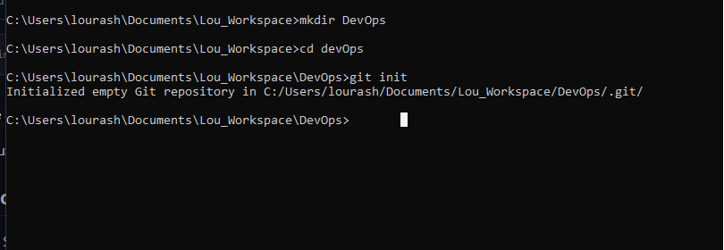

Making your first Commit
In the last section we successfully created our working directory and initialized it a git repository. Now we will make our first commit.
Before making our first commit lets try to understand what a commit is in git. Commit is more or less saving the changes you made to your files. Changes can be adding, modifying or deleteing files or text.
When your make a commit, git takes a snapshot of the current state of your repository and saves a copy in the .git folder inside your working directory.
Now lets make our rst commit by following these steps:
*   Inside your working directory create a file index.txt using this command **touch index.txt** 
*   Write any sentence of your choice inside the text file. Afterwards, save your changes. 
*   Add your changes to git staging area using this command **git add .**
*   To commit your changes to git, run the command **git commit -m "initial commit"**

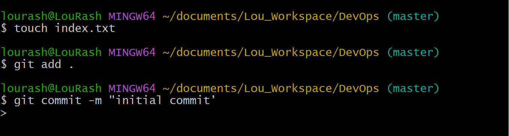

### Working with Branches
Working with Branches
Imagine you have a note book and you want to write different story on different pages of your note book so that you do not mess up your previous note.
git branch helps you create a different copy(page) of your source code. In your new branch you can make changes as you please. Your change is independent of what is available in the main copy.
Git branch is commonly used to develop new feature of your application. You will agree with me that the initial code is untested and as such can not be added to the code base of your live application.
Git branch is also an important tool for collaboration within remote teams(developers working from different location). They can make separate branches while working on same feature. And at the end of the day, converge their code to one branch.


### Make you first git Branch
To make a new branch run this command: `git checkout -b
The -b flag helps your create and change into the new branch
With that said lets make our first branch following these steps:

Having made our first commit in th previuos lesson
Make a new branch by running this command 

```markdown
git checkout -b my-new-branch
```

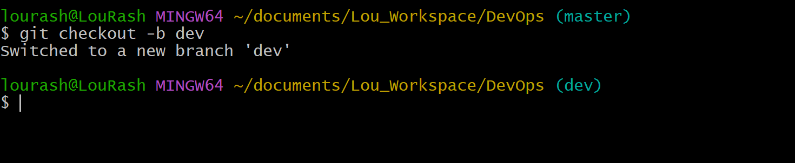

**Listing your git Branches**
Use the command below to list the branches on your local git repository

 ```markdown
 git branch
 ```

 **Change into an Old Branch**
To change into an exiting or old branch use the command below:
```markdown
git checkout <branch-name>
```
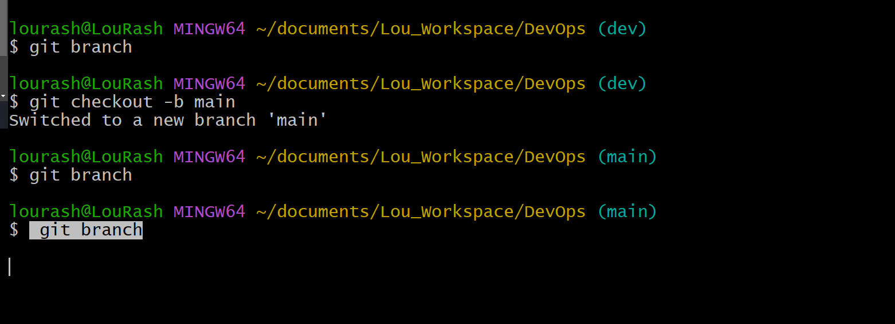

**Merging a Branch into another Branch**
Lets say we have two branches A and B. And we want to add the content of branch B into A.
First we change into branch A and run the git command below:

 ```markdown
 git merge B
 ```

**Deleting a git branch**
When new feature is added to an application, Its often done in a feature branch. Usually this feature branch is deleted when the code must have tested and merged into a staging or dev environment depending on the branch strategy of the team.
Git branch can be deleted with the command below:


```markdown
 git branch -d <branch_name>
```


This is by no means all that you can do with branches in git. To learn more type the command  git branch --help on your terminal.

### Collaboration and Remote Repositories
Collaboration and Remote Repositories
Git is a distributed version control system.
That essentially solves the problem sharing source code and tracking changes made to source code.
We then learnt about some operations like initializing git repository in our local machine, creating commit, branches etc.
We also mentioned in passing that git is used for collaboration among remote teams(developers residing in different location). But come to think of it how can developers working remotely collaborate(making changes, adding, updating etc) on the same code base since we currently have our code in our local computer.
This where github comes in. Github is a web based platform where git repositores are hosted. By hosting our local git repository on github, it becomes available in the public internet(it is possible to create private repository as well). Anyone can now access it.
Remote teams can now view, update, and make changes to the same repository.


Creating a Github Account
step 1: Head over to join github.com 

step 2: Next enter your username, password, and email

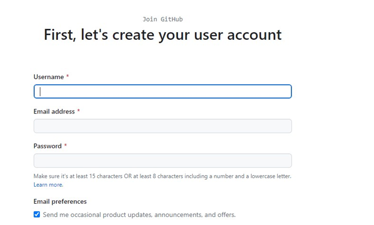

step 3: Next click on the verify buttom to very your identity

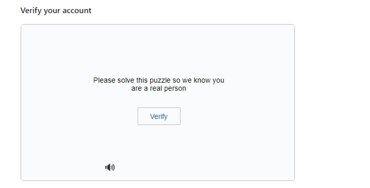

step: 4 Next click on the Create buttom to create your account

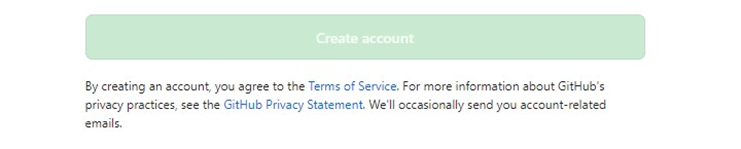

step 5: An activation code will be sent to your email, enter the code in textboxes provided then click continue

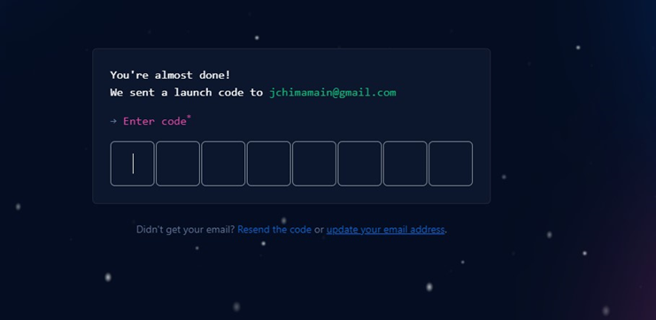

step 6: Select your preferences and click continue
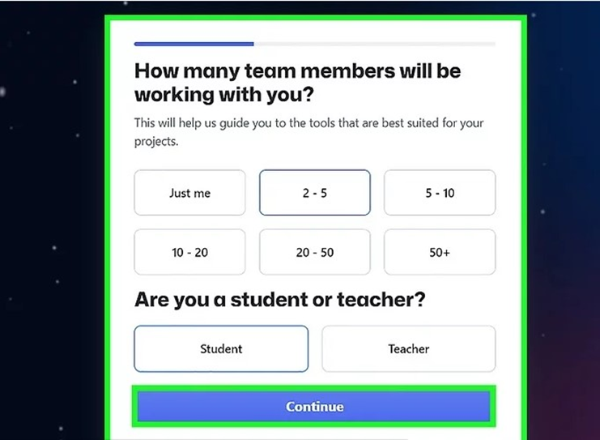

step 6: A list of github plans will be shown to you. Click continue for free

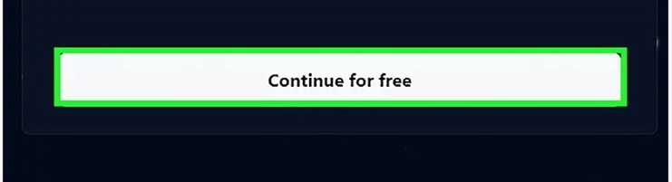

Creating your First Repository
step 1: click on the plus sign at the top right corner of your github account. A drop down menu will appear, select new repository

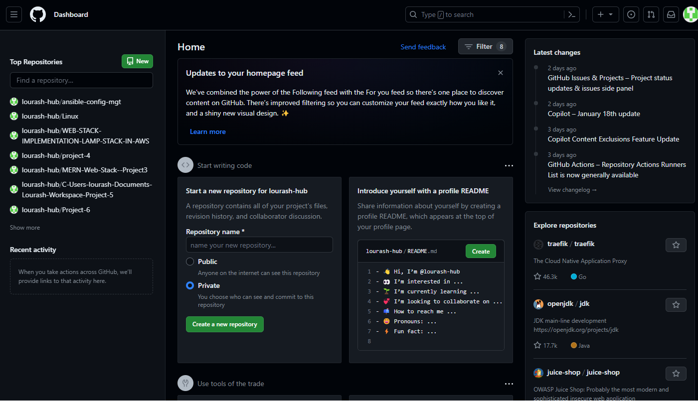


step 3: click the green button below to create your repository.


### Pushing your Local git Repository to your Remote github Repository.
In previous lessons, we have writing our story in our local git repository. Our colleague is interested in contributing to our story but he is unable to do so because we currently have our story locally in our machine.
Having created a github account and a github repository in earlier steps, Lets send a copy of our story to our repository in github.

We will achieve this by following the steps below:

* Add a remote repository to the local repository using the command below:

```markdown
git remote add origin <link to your github repo>
```

